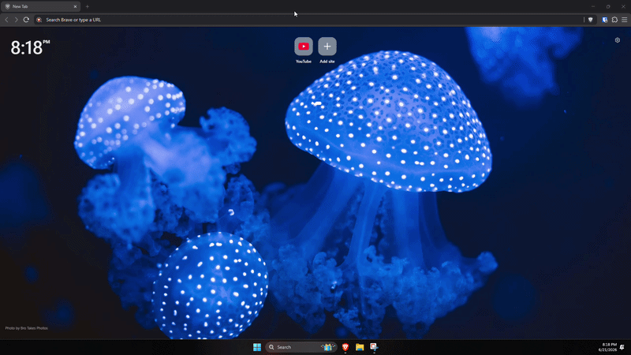

<div align="center">
  

  <h1>Gemini Desktop</h1>

  <p><strong>A premium, highly optimized cross-platform desktop wrapper for Google Gemini.</strong></p>

  <a href="https://github.com/Omux25/gemini-desktop-app/releases/latest">
    
  </a>
  <a href="https://github.com/Omux25/gemini-desktop-app/releases">
    
  </a>
  <br>
  <br>
  <a href="https://github.com/Omux25/gemini-desktop-app/releases/latest">
    
  </a>
  <a href="https://github.com/Omux25/gemini-desktop-app/releases/latest">
    
  </a>
  <a href="https://github.com/Omux25/gemini-desktop-app/releases/latest">
    
  </a>
</div>

<br>

This application brings Google Gemini out of your browser tabs and turns it into a native, powerful desktop assistant for Windows, macOS, and Linux. Built with Electron, optimized for extreme performance, and packed with features.

## ✨ Features

- **Smart Global Hotkey:** Instantly summon or hide the chat window from anywhere without interrupting your workflow. If the window is buried behind a game or browser, the hotkey instantly snaps it to the front.
  - Windows / Linux: `Alt + Space`
  - macOS: `Command + Option + Space`
- **Native Auto-Updater:** Seamlessly checks for and downloads new versions in the background (Windows & macOS).
- **Native Microphone Support:** Securely handles native OS microphone permission requests so you can seamlessly use Voice-to-Text.
- **Smart Window Memory:** Automatically tracks and remembers your exact window position (X/Y coordinates) so the app respawns right where you left it.
- **Always on Top:** Pin the window so you can easily reference Gemini while gaming, coding, or working. Uses the native Windows `pop-up-menu` level to successfully overlay Full-Screen Exclusive games.
- **Custom Window Sizes:** Switch between Compact, Standard, Tall, and Large presets to perfectly fit your screen.
- **Custom Offline Mode:** A sleek, native "No Internet" UI that intercepts drops and prevents Chromium crash screens.
- **Background Tray Utility:** Runs quietly in the background (hidden from the Windows Taskbar and macOS Dock) to stay completely out of your way until summoned.
- **Memory Optimized:** Automatically throttles resources, suspends background tabs, and forces deep garbage collection when hidden to save RAM.

## 📥 Download & Install

Download the latest version for your operating system from the **[Releases Page](https://github.com/Omux25/gemini-desktop-app/releases)**.

* **Windows:** Download `Gemini-Desktop-Setup.exe` (or `Portable.exe`)
* **macOS (Apple Silicon):** Download `Gemini-Desktop-arm64.dmg`
* **Linux (Ubuntu/Debian):** Download `gemini-desktop_amd64.deb` 
* **Linux (Other):** Download `.AppImage`

> [!NOTE]
> **Windows Users:** Because this is a free, open-source project without a paid EV Code Signing Certificate, Microsoft Defender SmartScreen will initially flag the `.exe` as "unrecognized". To install the app, click **More info** -> **Run anyway**.

## 🐧 Linux Power Users (Wayland, Sway, i3, Hyprland)

Wayland and Tiling Window Managers intentionally block applications from setting global hotkeys. To use the global hotkey feature, you can bind your Window Manager's hotkey to the `--toggle` command.

1. Ensure Gemini Desktop is already running in the background.
2. Add a keybind to your config file to execute `gemini-desktop --toggle`.

**Example (Sway / i3):**
```bash
bindsym $mod+Space exec gemini-desktop --toggle
```
**Example (Hyprland):**
```bash
bind = $mainMod, SPACE, exec, gemini-desktop --toggle
```

*(Note: We have natively patched Wayland resizing bugs by injecting `ozone-platform-hint=auto` into the core).*

## 🛠️ Building from Source

This project uses an automated GitHub Actions pipeline to compile releases, but you can also build it locally:

1. Ensure you have [Node.js 24+](https://nodejs.org/) installed.
2. Clone this repository:
   ```bash
   git clone https://github.com/Omux25/gemini-desktop-app.git
   cd gemini-desktop-app
   ```
3. Install dependencies:
   ```bash
   npm install
   ```
4. Build the application:
   ```bash
   npm run dist
   ```

## 📜 License

This project is licensed under the **PolyForm Noncommercial License 1.0.0**.
You are completely free to use, modify, distribute, and build upon this code for non-commercial purposes only.
